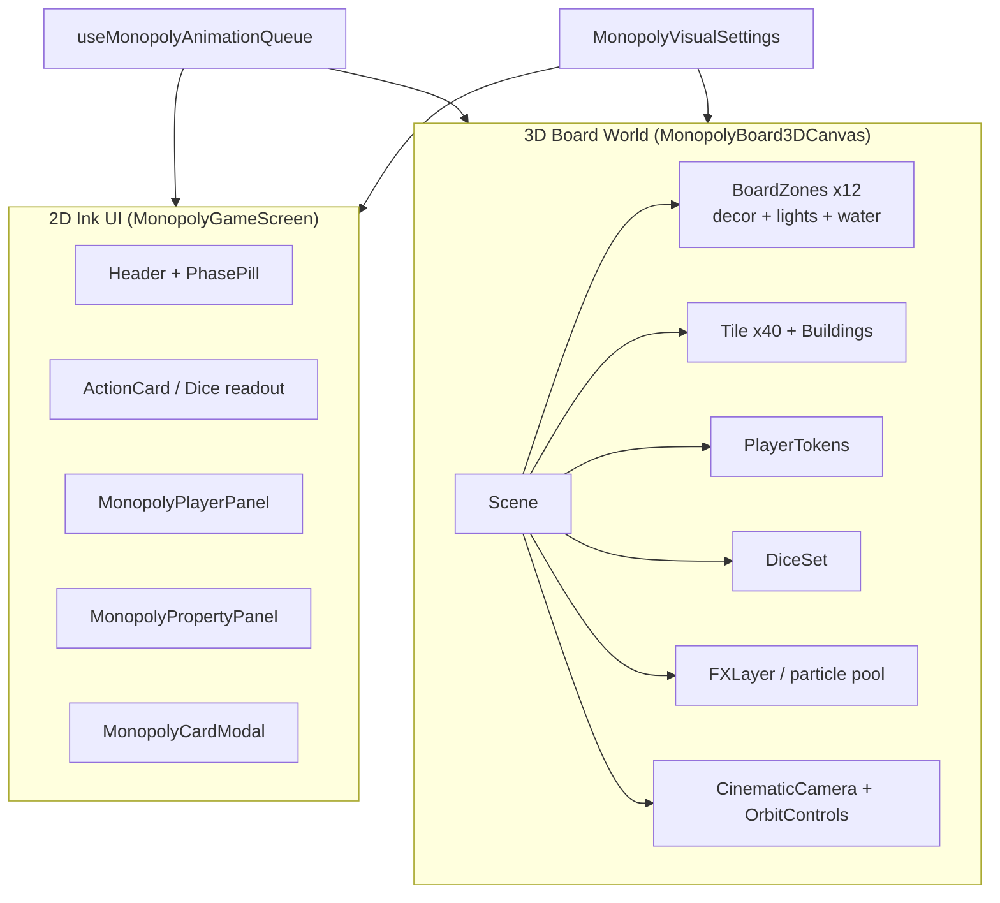
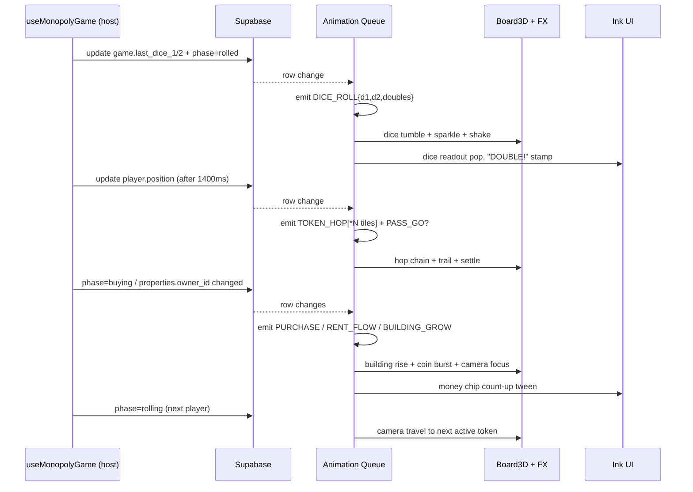

# Design Document

## Overview

This design turns the current "flat-ish" MimicPoly mode into a **cartoon-premium next-gen party-game** experience without rewriting its multiplayer or game-logic foundations. The 5 existing components (`MonopolyGameScreen`, `MonopolyBoard3D`, `MonopolyPlayerPanel`, `MonopolyPropertyPanel`, `MonopolyCardModal`) and the `useMonopolyGame` hook stay the canonical contracts. We layer richer visuals, audio, and cinematic camera behaviour on top of them through a **purely state-diff-driven rendering pipeline**: visuals never write to Supabase, never block turn flow, and reconstruct deterministically on join/rejoin.

The design is organised into four layers:

1. **Game-state layer** (unchanged): `useMonopolyGame` + Supabase tables (`monopoly_games`, `monopoly_players`, `monopoly_properties`).
2. **State-diff → render-event layer** (new, pure): a `useMonopolyAnimationQueue` hook that watches state and emits a deterministic, ordered queue of `RenderEvent`s (DICE_ROLL, TOKEN_HOP, BUILDING_GROW, MONEY_FLOW, CARD_DRAW, JAILED, BANKRUPT, GAME_END, …). This layer is pure and is where property-based testing applies.
3. **3D render layer**: refactored `MonopolyBoard3D` split into a board world (zones, decor, water plaza, neon corners), tokens with squash/stretch hops, dice with physics-feel tumble, building progression (terrain → 1-4 houses → hotel), an FX layer (particle pool, money streams, confetti, screen shake), and a `CinematicCamera` controller with idle drift, follow lerp, focus zoom, and OrbitControls override.
4. **2D UI layer**: `MonopolyGameScreen` keeps its existing structure but its inner pieces (player panel spotlight, money chip, property cards, card modal) get richer animations, monopoly stamps, money count-up tweens, and a phase-aware accent tint, all built strictly on `InkPrimitives`.

A `MonopolyVisualSettings` provider centralises performance + accessibility decisions (mobile detection, `prefers-reduced-motion`, particle caps, LOD distances, shader budget), so individual components consume one source of truth. No FPS counter, ping indicator, or hardware overlay is ever rendered.

The end result: every meaningful Supabase row change produces a satisfying, audible, identical reaction on all clients (humans and bots), while the game-logic loop in `useMonopolyGame` keeps running on its current 1400ms landing window with zero blocking.

## Architecture

### High-level data flow

```mermaid
flowchart LR
    SB[(Supabase tables<br/>monopoly_games / players / properties)] -->|Realtime| HOOK[useMonopolyGame<br/>game logic + bot AI]
    HOOK -->|state| QUEUE[useMonopolyAnimationQueue<br/>pure state-diff -> RenderEvent[]]
    QUEUE -->|RenderEvent[]| BOARD[MonopolyBoard3D<br/>3D world]
    QUEUE -->|RenderEvent[]| FX[FXLayer<br/>particles / shake / overlays]
    QUEUE -->|RenderEvent[]| AUDIO[AudioLayer<br/>playInkSound]
    QUEUE -->|RenderEvent[]| CAM[CinematicCamera]
    HOOK -->|state| UI[MonopolyGameScreen + panels<br/>2D Ink UI]
    SETTINGS[MonopolyVisualSettings<br/>reducedMotion / mobile / budgets] --> BOARD
    SETTINGS --> FX
    SETTINGS --> CAM
    SETTINGS --> UI
```

Key properties of this flow:

- **Single source of truth**: only `useMonopolyGame` writes to Supabase. The animation queue is read-only over its outputs.
- **Pure derivation**: `RenderEvent[]` is a pure function of consecutive snapshots `(prev, next)` plus a small render-state cursor. Late-joining or rejoining clients seed from the current snapshot only and skip past events; visual state converges from the snapshot itself.
- **No animation tables / no extra channels**: we piggyback on the three existing tables and channels.
- **Bots are equal citizens**: bot turns produce the same row updates and therefore the same `RenderEvent[]`, so animations, FX, camera, and audio fire identically.

### Render-side architecture



### Lifecycle of a turn



### Design rationale

- **Why a derived queue instead of new realtime events?** Requirement 10 forbids new tables/channels. State diffing over the existing snapshots yields identical event streams on every client and is naturally idempotent on rejoin.
- **Why no physics dependency?** Requirement 4.7 + 13.5 favour reusing what we have. Damped tweens via `useFrame` + hand-tuned easing (with optional `maath/easing` if budget allows) deliver a "physics feel" with no new gzipped weight. We deliberately do **not** add `framer-motion-3d` unless a measurable gap appears; current animations already use `framer-motion` (2D) and `useFrame` (3D).
- **Why a particle pool?** Requirement 11.3 caps active systems and forbids per-frame allocations. A small pre-allocated pool (`THREE.Points` instances reused via a `useParticles()` registry) keeps GC pressure flat.
- **Why a `MonopolyVisualSettings` provider?** Centralises three orthogonal concerns (mobile / reduced-motion / sustained-fps) so any subtree can opt out of expensive effects without prop-drilling.

## Components and Interfaces

This section describes the components after the overhaul. Public component contracts (`MonopolyBoard3DCanvas` props, panel props, modal props) are preserved; internal structure is rebuilt.

### 1. `MonopolyVisualSettings` (new, src/components/monopoly/visual/MonopolyVisualSettings.tsx)

Centralised settings used by every render layer.

```ts
export interface MonopolyVisualSettings {
  reducedMotion: boolean;          // window.matchMedia('(prefers-reduced-motion: reduce)')
  isMobile: boolean;               // pointer:coarse + viewport width <= 900px
  perfTier: 'high' | 'medium' | 'low'; // adapted from rolling fps probe
  particleSystemCap: number;       // default 8; 4 on low
  particlesPerSystemCap: number;   // default 60; 24 on low
  shadowMapSize: number;           // 1024 / 512 / 0
  buildingLodNear: number;         // 12 (units)
  enableSecondaryLights: boolean;  // disabled on low / mobile when fps drop sustained
  cameraIdleDriftEnabled: boolean; // false when reducedMotion
}
```

Provided by `<MonopolyVisualSettingsProvider>` wrapping `MonopolyGameScreen`'s tree. A small hidden `useFpsProbe()` (no UI) flips `perfTier` when sustained FPS < 40 for 2s (requirement 11.2). `console.debug` only — never rendered.

### 2. `useMonopolyAnimationQueue` (new, src/hooks/useMonopolyAnimationQueue.ts)

Pure hook that watches `(game, mPlayers, properties)` and emits an ordered `RenderEvent[]` queue. **This is the unit-testable / property-testable core of the visual layer.**

```ts
export type RenderEvent =
  | { kind: 'DICE_ROLL'; d1: number; d2: number; doubles: boolean }
  | { kind: 'TOKEN_HOP'; playerId: string; from: number; to: number; passedGo: boolean }
  | { kind: 'PASS_GO'; playerId: string; tile: number }
  | { kind: 'PURCHASE'; playerId: string; tile: number; price: number }
  | { kind: 'BUILDING_GROW'; tile: number; oldHouses: number; newHouses: number }
  | { kind: 'MORTGAGE'; tile: number; mortgaged: boolean }
  | { kind: 'RENT_FLOW'; from: string; to: string; amount: number }
  | { kind: 'MONEY_DELTA'; playerId: string; delta: number; reason: 'collect' | 'pay' | 'tax' | 'go' | 'free_parking' | 'rent' | 'unknown' }
  | { kind: 'CARD_DRAW'; playerId: string; cardId: string }
  | { kind: 'JAILED'; playerId: string }
  | { kind: 'UNJAILED'; playerId: string }
  | { kind: 'BANKRUPT'; playerId: string }
  | { kind: 'GAME_END'; winnerId: string };

export interface AnimationQueueAPI {
  events: RenderEvent[];           // append-only ring buffer (last ~32)
  consume: (predicate: (e: RenderEvent) => boolean) => void; // FX side acks
}

export function useMonopolyAnimationQueue(
  game: MonopolyGame | null,
  players: MonopolyPlayer[],
  properties: MonopolyProperty[],
): AnimationQueueAPI;
```

Diff rules (deterministic order — see Requirement 10.8):

1. `DICE_ROLL` if `last_dice_1/2` change.
2. For each player, `TOKEN_HOP` (with `passedGo`) if `position` changed; tile-by-tile expansion is computed by the consumer (Board3D), the queue only emits one HOP event per Supabase update.
3. `PASS_GO` is implied by `passedGo: true`.
4. `JAILED` / `UNJAILED` if `in_jail` flipped.
5. `BANKRUPT` if `is_bankrupt` flipped.
6. `MONEY_DELTA` for any money diff (with a `reason` heuristic: matches `RENT_FLOW` if another player gained the same amount on the same diff; matches purchase if owner just appeared).
7. `RENT_FLOW` if a player paid and the property owner's money increased by the same delta on the same row update.
8. `PURCHASE` if a property's `owner_id` went `null → X`.
9. `BUILDING_GROW` if `houses` increased.
10. `MORTGAGE` if `is_mortgaged` flipped.
11. `CARD_DRAW` if `phase` becomes `'card'`.
12. `GAME_END` if `is_finished` becomes `true`.

The function is pure: same `(prev, next)` pair always yields the same event list in the same order. Late joiners receive an empty queue (cursor seeded to `next` only).

### 3. `MonopolyBoard3DCanvas` (refactor of src/components/monopoly/MonopolyBoard3D.tsx)

Public props are unchanged. Internally split into:

```
MonopolyBoard3D.tsx
└── <MonopolyBoard3DCanvas>           // Canvas + DOM corner UI
    ├── <Scene>                        // root group + lights + fog
    │   ├── <BoardBase />               // chamfered green plate + ink shadow
    │   ├── <BoardZone /> × 12          // 8 color groups + 4 corners
    │   │   ├── <ZoneLights />
    │   │   ├── <ZoneDecor />            // animated cartoon decor (sway/blink/hop)
    │   │   └── <ZoneAccentRing />       // monopoly glow ring (Req 3.7)
    │   ├── <Tile /> × 40                // existing BoardTile evolved
    │   │   └── <Building />              // terrain | 1-4 houses | hotel
    │   ├── <CenterPlaza>                 // logo + animated water/energy ribbon
    │   ├── <NeonCorner /> × 4            // pulsing neon signs
    │   ├── <PlayerToken /> × N           // squash/stretch hop + trail + spotlight
    │   ├── <DiceSet />                   // 2 dice with damped tumble
    │   ├── <FXLayer />                   // particle pool + screen-shake bus
    │   └── <CinematicCamera />            // idle drift + follow + focus
    └── <BoardCornerBadge />              // existing 3D BOARD pill (kept)
```

#### `<BoardZone>` (new)

Inputs: `groupKey` (one of 8 color groups + 'corner_go' / 'corner_jail' / 'corner_free' / 'corner_gtj'), `tiles: number[]`, `palette: ZonePalette`.

Responsibilities:
- Render a sub-group with zone-specific accent point lights (Req 1.4) sized to the zone footprint.
- Render at least one `ZoneDecor` element per zone with a continuous idle animation (Req 2.3, 2.6).
- Render a `<MonopolyAccentRing>` around all zone tiles when the active player owns the whole group (Req 3.7).

`ZonePalette` is a const map keyed on `PropertyGroup`:

```ts
const ZONE_PALETTES: Record<string, ZonePalette> = {
  brown:     { base: '#8B4513', accent: '#fbbf24', light: '#ffaa44', decor: 'lamppost' },
  lightblue: { base: '#87CEEB', accent: '#06b6d4', light: '#88e1ff', decor: 'fountain'  },
  pink:      { base: '#FF69B4', accent: '#ec4899', light: '#ffb3da', decor: 'neonsign'  },
  orange:    { base: '#FFA500', accent: '#fb923c', light: '#ffc977', decor: 'bench'     },
  red:       { base: '#FF0000', accent: '#ef4444', light: '#ff6b6b', decor: 'minicar'   },
  yellow:    { base: '#FFD700', accent: '#fbbf24', light: '#ffe066', decor: 'tree'      },
  green:     { base: '#228B22', accent: '#22c55e', light: '#7be07b', decor: 'tree'      },
  darkblue:  { base: '#00008B', accent: '#a855f7', light: '#9999ff', decor: 'spotlight' },
  corner_go:        { base: '#fbbf24', accent: '#fbbf24', light: '#ffeaa0', decor: 'go_arrow_neon'   },
  corner_jail:      { base: '#ef4444', accent: '#ef4444', light: '#ff8888', decor: 'jail_bars'        },
  corner_free:      { base: '#06b6d4', accent: '#06b6d4', light: '#88e1ff', decor: 'parking_neon'     },
  corner_gtj:       { base: '#a855f7', accent: '#a855f7', light: '#caa3ff', decor: 'gtj_lights'       },
};
```

Decor uses `<Float>` (drei) or hand-tuned `useFrame` sin/cos drivers.

#### `<CenterPlaza>` (evolves existing `BoardCenter`)

Adds a continuous animated water / "energy ribbon" surface (Req 2.4): a `<mesh>` with a `ShaderMaterial` whose fragment shader UV-scrolls a stylised sine-noise pattern using `uniforms.u_time` updated in `useFrame`. Falls back to a textured plane scrolling its `offset` if perf tier = low.

#### `<NeonCorner>` (new)

A neon sign mesh with `MeshBasicMaterial` toneMapped=false + emissive intensity oscillating via `useFrame` on a 1.5–2.5s loop. Three of the four corners must satisfy Req 2.5.

#### `<Tile>` (refactor of `BoardTile`)

Receives ref to the tile's index and to the property snapshot. New behaviours:
- Owned-but-empty terrain receives a small fenced `<TerrainBadge ownerColor={…} />` (Req 3.1).
- Mortgaged → applies a grayscale post-effect via `MeshStandardMaterial` color blend + tilts buildings group (Req 3.5).
- Carries a `<Building>` child whose props derive from `houses`.

#### `<Building>` (new)

```ts
interface BuildingProps {
  tileIndex: number;
  houses: number;            // 0..5, derived from monopoly_properties.houses
  ownerColor: string | null;
  isMortgaged: boolean;
  growEvent?: { from: number; to: number; ts: number }; // from queue
  reducedMotion: boolean;
  lod: 'near' | 'far';
}
```

Rendering rules (Req 3):
- `houses === 0 && ownerColor` → `<TerrainBadge>` (fenced lot).
- `1..4` → that exact number of `<HouseMesh>` placed at deterministic grid positions: `[-0.5, -0.18, 0.18, 0.5]` along x, z = -0.4. No two houses overlap.
- `5` → single `<HotelMesh>` replacing all houses.
- On `growEvent`, a `useFrame` tween scales the new building from 0 → 1 with elastic overshoot over 600–1200ms and emits a one-shot dust particle (Req 3.4). Reduced-motion → snap to final state in ≤200ms.
- Far LOD swaps each `<HouseMesh>` for a `<RoundedBox>` only (no roof) (Req 11.4).

#### `<PlayerToken>` (refactor)

Adds:
- **Hop chain controller**: when a `TOKEN_HOP` event arrives, the component computes the path `[from+1, from+2, …, to]` (with wraparound at 40) and runs a per-tile spring tween (120–280ms each) using `useFrame` + a small finite-state machine inside a ref (`{ phase: 'idle'|'anticipate'|'jump'|'land', tileCursor }`). At each tile, scale x is squeezed (1→0.7→1.2→0.85→1) (Req 5.2).
- **Color trail**: a short ribbon of `THREE.Mesh` quads with a fading `MeshBasicMaterial` opacity gradient, color = `TOKEN_COLORS[token_type]` (Req 5.3).
- **Settle reaction**: after the last hop, a one-shot dust puff + glow pulse pointLight for 300–600ms (Req 5.4).
- **Pass-Go FX**: when `passedGo` is true on the last hop, emits `PASS_GO` event consumption — spawns a floating "+200$" billboard via `<Text>` + a coin burst pooled particle (Req 5.8).
- **Multi-token offset** is now derived from `playerOrder.indexOf(playerId)` (deterministic across clients) instead of array-render index (Req 5.7).

#### `<DiceSet>` (new, replaces inline pair)

```ts
interface DiceSetProps {
  d1: number | null; d2: number | null;
  rolling: boolean;     // queue-driven
  reducedMotion: boolean;
}
```

Internally:
- Pre-rolls a deterministic angular trajectory seeded from `(d1, d2)` so all clients see the same path.
- Damped tween over 700–1400ms that lands each die on the rotation matrix corresponding to its face (rotation lookup table per face value).
- Emits a `useImpactFX(magnitude=2..6, durMs=150..300)` on settle (Req 4.3).
- `rolling` is owned by the queue (`DICE_ROLL` event) and capped at `< 1500ms` so the host's 1400ms `setTimeout(handleLandingFor)` is never blocked (Req 4.6).
- Reduced-motion: skips tumble; renders final faces with a 200ms fade-in.

#### `<FXLayer>` (new, src/components/monopoly/visual/FXLayer.tsx)

Owns the **particle pool** and the **screen-shake bus**. Pool is a registry of pre-allocated `THREE.Points` systems (max = `particleSystemCap`). When an effect needs particles, it `acquire()`s a system, sets its emit parameters, and `release()`s on completion. If pool is exhausted, the request is dropped (Req 11.3) — never queued, never blocks.

Effects exposed:

```ts
useFXBus().play({
  kind: 'COIN_BURST'    | 'DUST_PUFF'  | 'SPARKLE'      | 'CONFETTI'
      | 'MONEY_STREAM'  | 'MONEY_RAIN' | 'COIN_LOSS'    | 'SHOCKWAVE'
      | 'JAIL_BARS'     | 'RED_FLASH'  | 'COLOR_FLASH'  | 'STAMP',
  // payload (positions, color, target, duration, etc)
});
```

`useScreenShake()` mutates a shared shake offset that the `<CinematicCamera>` reads each frame. Capped by Req 12.5 (no full-screen flashes brighter than 50% > 3 Hz).

#### `<CinematicCamera>` (new)

Wraps drei's `<OrbitControls>`. Internal state machine:

```
idle (slow drift) <-> follow(activePlayerId) <-> focus(target, durMs) <-> userOverride
```

- `idle` runs a smooth orbit < 5°/s with a tiny breathing zoom (Req 7.1).
- `follow` lerps toward the active token with `0.06..0.18` factor (Req 7.3).
- `focus` runs a 600–1500ms easeOut tween toward a tile/token (Req 7.4).
- A whip-pan (<500ms) is queued on `DICE_ROLL` with `doubles=true` (Req 7.5).
- User dragging on `<OrbitControls>` flips state to `userOverride` for 4s after last input (Req 7.6).
- Floor clamp: distance to origin ≥ 8 (Req 7.7).
- `reducedMotion` → state machine collapses to a single `userOverride` framing with no auto-moves (Req 12 + 7.8).

### 4. `MonopolyGameScreen` (refactor)

Public props unchanged. Wraps the tree with:

```tsx
<MonopolyVisualSettingsProvider>
  <InkGameStage accent={turnPlayerColor}>
    {/* header / body / panels — existing structure */}
  </InkGameStage>
</MonopolyVisualSettingsProvider>
```

Adds a `useMonopolyAnimationQueue(game, mPlayers, properties)` consumer that:
- forwards `events` to the 2D pieces (e.g. money chip count-up tween consumes `MONEY_DELTA`),
- triggers SFX via `playInkSound` mapped 1-to-1 to event kinds (Req 9.4),
- never reads or writes Supabase directly.

The existing phase pill, action card, message banner, dice readout, and action buttons all stay; their styling gets the new spring entrance + phase accent (Req 8.6) but no contractual change.

The existing **stuck-loading recovery** (4s timeout → host can `forceRestart`), **quit button**, **properties toggle**, **free-parking pot badge**, and **end-screen ranking** are preserved verbatim (Req 13.8).

### 5. `MonopolyPlayerPanel` (refactor)

Public props unchanged. New internals:
- The active player's row gets an animated wobble token disc, a glowing border in the player color, and an animated `<TourCrownBadge>` (Req 8.2). The crown is already partially implemented as a `Crown` icon — promoted to a stamp with continuous `rotate: [-3, 3]`.
- `MoneyChip` upgraded to count-up/down via `framer-motion`'s `useMotionValue + useTransform` (300–700ms) and flashes green/red based on delta sign (Req 8.3). Delta is derived from queue `MONEY_DELTA`.
- Bankrupt rows get `BANKRUPT` event-driven shrink-and-fade.

### 6. `MonopolyPropertyPanel` (refactor)

Public props unchanged. New internals:
- Per-color-group header lights up its `MONOPOLE` star stamp once `ownsAll` (Req 8.4) — already partially implemented; we add a continuous accent glow.
- A pulsing glow on a property card when the queue emits `PURCHASE`, `BUILDING_GROW`, or `MORTGAGE` for that property (Req 8.7), driven by ref + `framer-motion` and removed after 1.5s.

### 7. `MonopolyCardModal` (refactor)

Public props unchanged. The modal opens after the queue emits `CARD_DRAW`; before opening, the FX layer plays a 3D card-flip cinematic in the board scene (Req 6.3) — the modal `initial` animation is delayed to chain after the swoosh sound finishes. Reduced-motion → no flip; modal opens with 200ms fade.

### 8. Audio mapping (extension of `useInkSoundEffects`)

A pure mapping table `RenderEvent.kind → SoundCue[]` is added in `src/lib/monopolyAudioMap.ts`. No new audio engine. New cues, if needed, are added inside `useInkSoundEffects.tsx` itself (Req 9.5):

| Event | Cue(s) |
|---|---|
| DICE_ROLL (rolling start) | `cartoonBoing` + `cartoonWobble` |
| DICE_ROLL (settle) | `cartoonPop` + `cartoonDing` |
| TOKEN_HOP (per hop) | `cartoonPop` (low vol, capped 12 voices, Req 9.3) |
| PASS_GO | `cartoonFanfare` |
| PURCHASE | `cartoonDing` |
| BUILDING_GROW | `cartoonBoing` + `cartoonDing` |
| MORTGAGE | `cartoonZap` |
| RENT_FLOW | `cartoonSwoosh` |
| CARD_DRAW | `cartoonSwoosh` |
| MONEY_DELTA (collect) | `cartoonDing` |
| MONEY_DELTA (pay) | `cartoonZap` |
| JAILED | `cartoonZap` |
| BANKRUPT | `cartoonZap` (long) |
| GAME_END | `cartoonFanfare` |

The existing phase-driven effects in `MonopolyGameScreen` (`cartoonWobble` on rolling, etc.) are kept (Req 9.5).

### 9. Module / file plan

Files added:

```
src/components/monopoly/
├── MonopolyBoard3D.tsx              (refactor)
├── MonopolyGameScreen.tsx           (refactor)
├── MonopolyPlayerPanel.tsx          (refactor)
├── MonopolyPropertyPanel.tsx        (refactor)
├── MonopolyCardModal.tsx            (refactor)
└── visual/
    ├── MonopolyVisualSettings.tsx
    ├── BoardZone.tsx
    ├── ZoneDecor.tsx
    ├── CenterPlaza.tsx
    ├── NeonCorner.tsx
    ├── Tile.tsx
    ├── Building.tsx
    ├── PlayerToken.tsx
    ├── DiceSet.tsx
    ├── FXLayer.tsx
    ├── CinematicCamera.tsx
    └── particles/
        ├── ParticlePool.ts
        └── effects.ts        // COIN_BURST, DUST_PUFF, MONEY_STREAM, etc.

src/hooks/
└── useMonopolyAnimationQueue.ts

src/lib/
├── monopolyAudioMap.ts                // RenderEvent.kind -> sound cue
├── monopolyZones.ts                   // tile -> zone mapping + ZONE_PALETTES
├── monopolyHopPath.ts                 // computeHopPath(from,to): number[]
└── monopolyDiff.ts                    // pure deriveRenderEvents(prev,next)
```

Public component exports stay backward-compatible (Req 13.1, 13.8). `useMonopolyGame` stays the only writer (Req 13.2).

## Data Models

The feature does **not** introduce any new Supabase tables, columns, or channels (Req 13.7). It only introduces in-memory render-state types.

### Existing Supabase rows (unchanged, summarised here for reference)

```ts
interface MonopolyGame {
  id: string;
  lobby_id: string;
  current_player_index: number;
  player_order: string[];
  phase: 'rolling' | 'rolled' | 'buying' | 'card' | 'bankrupt' | 'finished';
  free_parking_pot: number;
  is_finished: boolean;
  winner_id: string | null;
  winner_name: string | null;
  last_dice_1: number | null;
  last_dice_2: number | null;
  doubles_count: number;
}

interface MonopolyPlayer {
  player_id: string;
  player_name: string;
  token_type: 'car'|'hat'|'shoe'|'dog'|'ship'|'thimble'|'iron'|'cannon';
  position: number;        // 0..39
  money: number;
  is_bankrupt: boolean;
  in_jail: boolean;
  jail_turns: number;
  has_get_out_of_jail_card: number;
  player_order: number;
}

interface MonopolyProperty {
  property_index: number;  // 0..39
  owner_id: string | null;
  houses: number;          // 0..5 (5 = hotel)
  is_mortgaged: boolean;
}
```

### New in-memory types

```ts
// src/lib/monopolyDiff.ts
export type RenderEvent = /* see Components section */;

// src/components/monopoly/visual/MonopolyVisualSettings.tsx
export interface MonopolyVisualSettings { /* see Components section */ }

// src/components/monopoly/visual/particles/ParticlePool.ts
export interface ParticleSlot {
  id: number;
  inUse: boolean;
  points: THREE.Points;
  positions: Float32Array;
  velocities: Float32Array;
  ttls: Float32Array;
}

// src/lib/monopolyZones.ts
export type ZoneKey =
  | 'brown' | 'lightblue' | 'pink' | 'orange' | 'red' | 'yellow' | 'green' | 'darkblue'
  | 'corner_go' | 'corner_jail' | 'corner_free' | 'corner_gtj';

export interface ZonePalette {
  base: string; accent: string; light: string;
  decor: 'lamppost'|'fountain'|'neonsign'|'bench'|'minicar'|'tree'|'spotlight'
       | 'go_arrow_neon'|'jail_bars'|'parking_neon'|'gtj_lights';
}
```

### Hop path

```ts
// src/lib/monopolyHopPath.ts
export function computeHopPath(from: number, to: number): number[];
// Returns the list of intermediate tiles [from+1, …, to] modulo 40, in turn order.
// Examples:
//   computeHopPath(0, 5)  -> [1,2,3,4,5]
//   computeHopPath(38, 2) -> [39, 0, 1, 2]   // passes GO
//   computeHopPath(7, 7)  -> []              // no hop
```

### Token offset (deterministic across clients)

```ts
// src/components/monopoly/visual/PlayerToken.tsx
export function tokenOffset(playerOrderIndex: number): { dx: number; dz: number };
// Deterministic from playerOrderIndex (0..7) — same on every client.
```

## Correctness Properties

*A property is a characteristic or behavior that should hold true across all valid executions of a system — essentially, a formal statement about what the system should do. Properties serve as the bridge between human-readable specifications and machine-verifiable correctness guarantees.*

This feature is a visual / UX overhaul layered on top of an existing multiplayer game. Most rendering, lighting, and look-and-feel criteria are not amenable to property-based testing — they are validated by visual review, snapshot tests, and example tests. The design intentionally extracts a **pure derivation layer** (`deriveRenderEvents`, `computeHopPath`, `tokenOffset`, `resolveBuildingKind`, the audio + FX mapping tables, the timing functions, the particle pool, the perf-tier classifier, the ownership predicate) where universal correctness invariants hold. Property-based testing applies to that pure layer; the rest is covered in the Testing Strategy section by smoke / example / snapshot / a11y tests.

The list below is the consolidated set of properties after the redundancy reflection pass.

### Property 1: deriveRenderEvents is pure and observer-independent

*For all* snapshot pairs `(prev, next)` of `(MonopolyGame, MonopolyPlayer[], MonopolyProperty[])`, calling `deriveRenderEvents(prev, next)` twice — and from any viewer perspective (different `currentPlayerId`, including any id starting with `bot-`) — returns the exact same ordered `RenderEvent[]`. The function performs no I/O.

**Validates: Requirements 5.6, 6.9, 10.1, 10.3, 10.7, 10.8, 11.7, 13.2, 13.6**

### Property 2: deriveRenderEvents emits the correct events for every diff kind

*For all* snapshot pairs `(prev, next)`, `deriveRenderEvents(prev, next)` emits:
- exactly one `DICE_ROLL{d1,d2,doubles}` iff `(last_dice_1, last_dice_2)` changed; `doubles === (d1===d2)`;
- exactly one `TOKEN_HOP{playerId, from, to, passedGo}` for every player whose `position` changed, with `passedGo === (to < from)`;
- exactly one `PURCHASE{playerId, tile, price}` for every property whose `owner_id` went from `null` to a non-null value;
- exactly one `BUILDING_GROW{tile, oldHouses, newHouses}` for every property whose `houses` increased;
- exactly one `MORTGAGE{tile, mortgaged}` for every property whose `is_mortgaged` flipped;
- exactly one `JAILED{playerId}` (resp. `UNJAILED`) for every player whose `in_jail` flipped `false→true` (resp. `true→false`);
- exactly one `BANKRUPT{playerId}` for every player whose `is_bankrupt` flipped `false→true`;
- exactly one `CARD_DRAW{playerId,…}` iff `phase` transitioned to `'card'`;
- exactly one `RENT_FLOW{from, to, amount}` iff exactly one player's money decreased by some `X > 0` and exactly one other player's money increased by the same `X` on the same diff;
- exactly one `GAME_END{winnerId}` iff `is_finished` transitioned to `true`, with `winnerId === next.winner_id`.

**Validates: Requirements 5.1, 5.8, 6.1, 6.2, 6.3, 6.6, 6.7, 6.8**

### Property 3: computeHopPath is a correct mod-40 forward path

*For all* `(from, to) ∈ [0, 40) × [0, 40)`, `computeHopPath(from, to)`:
- has length equal to `(to - from + 40) mod 40`;
- contains only values in `[0, 40)`;
- is strictly increasing modulo 40 (each next index is `(prev + 1) mod 40`);
- ends with `to` if length > 0;
- contains `0` iff the player passes GO (i.e. `from !== 0` and `from > to`), which equals the `passedGo` flag emitted by Property 2.

**Validates: Requirements 5.1, 5.5, 5.8**

### Property 4: resolveBuildingKind matches the documented building rules

*For all* `MonopolyProperty` snapshots `p`, `resolveBuildingKind(p)` returns:
- `'mortgaged'` iff `p.is_mortgaged === true` (overlays the kind below);
- `'terrain'` iff `p.owner_id !== null && p.houses === 0`;
- `'house', count: p.houses` iff `1 ≤ p.houses ≤ 4`;
- `'hotel'` iff `p.houses === 5`;
- `'empty'` iff `p.owner_id === null && p.houses === 0`.

Additionally, `houseSlotPositions(n)` for any `n ∈ [1, 4]` returns `n` distinct (x, z) positions whose pairwise x-distance is ≥ `0.3` units (no overlap).

**Validates: Requirements 3.1, 3.2, 3.3, 3.5**

### Property 5: Animation durations respect documented bounds and reduced-motion

*For all* animation requests `req` (kinds: dice tumble, dice settle, token hop, settle reaction, building grow, building unmortgage snap, money stream, money rain, card flip, camera travel, camera focus, whip-pan, MoneyChip count tween) and *for all* `reducedMotion ∈ {true, false}`, `durationFor(req, reducedMotion)` returns a value:
- in the bounds documented per kind when `reducedMotion === false` (e.g. dice tumble ∈ [700, 1400]ms, hop ∈ [120, 280]ms, building grow ∈ [600, 1200]ms, settle ∈ [300, 600]ms, unmortgage ∈ [300, 700]ms, camera travel ∈ [600, 1200]ms, focus ∈ [600, 1500]ms, whip-pan < 500ms, MoneyChip ∈ [300, 700]ms, dice settle shake ∈ [150, 300]ms);
- `≤ 200`ms when `reducedMotion === true`;
- and the total per-roll movement time `totalHopDurationMs(roll) < 3000`ms for any roll `r ∈ [2, 12]`;
- and the total dice animation time `< 1500`ms so that the host's 1400ms `setTimeout(handleLandingFor)` is never blocked.

**Validates: Requirements 3.4, 3.6, 4.1, 4.3, 4.6, 5.4, 5.5, 7.2, 7.4, 7.5, 8.3, 12.2**

### Property 6: Reduced motion zeroes continuous animation rates

*For all* continuous animators `a` declared by the visual layer (camera idle drift, decor sway, water/energy ribbon UV scroll, neon emissive pulse, glow pulse, monopole accent ring), `a.rateUnder(reducedMotion = true) === 0`. Combined with Property 5's ≤200ms bound, this ensures no continuous decorative motion plays under `prefers-reduced-motion: reduce`.

**Validates: Requirements 12.1, 7.8**

### Property 7: Token offsets and trail/halo colors derive deterministically from player data

*For all* player ids and *for all* `playerOrderIndex ∈ [0, 8)`:
- `tokenOffset(playerOrderIndex)` is a pure function (same input, same output across clients);
- the offsets for any subset of `[0, 8)` are pairwise distinct with minimum 2D distance `≥ 0.25` units (no full occlusion);
- `tokenTrailColor(player) === TOKEN_COLORS[player.token_type]`;
- the active-player halo color and panel border color also equal `TOKEN_COLORS[player.token_type]`.

**Validates: Requirements 1.5, 5.3, 5.7**

### Property 8: Audio and FX maps are total and distinct per kind

*For all* `RenderEvent.kind` values, `audioMap(kind)` returns a non-empty list of cues drawn from `useInkSoundEffects` (no parallel engine), and `fxMap(event)` returns a non-empty list of `FXKind` entries. The mapping documented in the Components section is total. Distinct kinds in the documented audio table map to distinct cue sequences (so e.g. PURCHASE ≠ MORTGAGE ≠ BANKRUPT acoustically). Calling `audioMap` with `muted = true` returns synchronously, produces no sound, throws no error, and does not affect queue progress.

**Validates: Requirements 6.4, 6.5, 9.1, 9.4, 9.6**

### Property 9: Ownership predicate drives monopole stamp and accent ring uniformly

*For all* `(state, playerId, group)`, the predicate `playerOwnsAllInGroup(state, playerId, group)`:
- equals `true` iff every tile in `getPropertiesInGroup(group)` has `owner_id === playerId`;
- and is the **single** predicate that gates both (a) the property panel `MONOPOLE` star stamp and (b) the 3D `<MonopolyAccentRing>` glow on those tiles. The accent color used in both places equals `TOKEN_COLORS[player.token_type]`.

**Validates: Requirements 3.7, 8.4**

### Property 10: Particle pool, LOD, and perf-tier classifier respect their bounds

*For all* sequences of `acquire()` / `release()` calls on the particle pool with `cap = particleSystemCap`, the count of active systems never exceeds `cap` (default 8) and the count of live particles per system never exceeds `particlesPerSystemCap` (default 60). Pool acquisition is non-blocking: if exhausted, `acquire()` returns `null` and the FX request is dropped.

*For all* camera distances `d ≥ 0` to the tile center, `lodFor(d) === 'near'` iff `d < 12`, else `'far'`.

*For all* fps time-series `s`, `perfTierFor(s) === 'low'` iff sustained FPS `< 40` for `≥ 2`s; `'high'` iff sustained FPS `≥ 55`; `'medium'` otherwise. The classifier is monotonic in the obvious sense (a strictly faster series cannot land in a lower tier).

**Validates: Requirements 11.2, 11.3, 11.4**

### Property 11: Camera state machine invariants

*For all* camera tween targets and *for all* user inputs the camera state machine sees, the camera produces a position trajectory `p(t)` such that:
- `‖p(t)‖ ≥ 8` units from the origin at every sampled `t` (no clipping into board / buildings / tokens);
- the idle-state angular velocity `|dθ/dt| ≤ 5°/s`;
- the follow-state lerp factor `α ∈ [0.06, 0.18]`;
- the state machine is in `userOverride` for at least 4 seconds following any user `OrbitControls` input;
- under `reducedMotion = true`, no auto state transition fires (the machine stays in `userOverride` with a static framing).

**Validates: Requirements 7.1, 7.3, 7.6, 7.7, 7.8**

### Property 12: Convergence after missed updates is bounded and snap-safe

*For all* `(prev_position, next_position)` pairs and *for all* configured interpolation budget `B` (in tiles):
- if `|forwardDistance(prev, next)| ≤ B`, the interpolation duration `T ∈ (0, 2000]`ms;
- if `|forwardDistance(prev, next)| > B`, `T = 0` (hard snap);
- in both cases, the visual position equals `next_position` after at most 2 seconds of wall clock following the new snapshot.

The same shape applies to money: small deltas tween over [300, 700]ms (Property 5), large deltas snap.

**Validates: Requirements 10.4, 10.5**

### Property 13: Critical UI affordances and information are always reachable

*For all* reachable game states (any value of `phase`, any `current_player_index`, any `is_finished`):
- the "Quit" / "QUITTER" button is rendered and clickable while the game is not in the loading branch;
- the properties-toggle button is rendered;
- the free-parking pot badge is rendered iff `free_parking_pot > 0`;
- the active player's name, dice values (when `last_dice_1/2` are set), money, owned properties, and current phase are queryable in the rendered DOM at all times — none of them is hidden behind an animation;
- the end-screen ranking is rendered iff `is_finished === true`, and lists every player ordered by `money` desc;
- the stuck-loading recovery branch reappears 4s after `(!game || mPlayers.length === 0)`;
- jail actions ("PAYER 50$", "CARTE SORTIE", "TENTER DOUBLE") render iff the active player is `in_jail`;
- bankruptcy declaration renders iff `phase === 'bankrupt'` or `myPlayer.money < 0`;
- mortgage / unmortgage / buy-house actions render under their existing preconditions in `MonopolyPropertyPanel`.

Conversely, *for all* reachable states, **no** element matches the forbidden set `{fps, ping, latency, hardware, perf-overlay}` is ever queryable in the DOM (negative invariant, Req 8.8 / 11.8).

**Validates: Requirements 8.8, 11.8, 13.8**

### Property 14: Critical state changes are conveyed by ≥ 2 channels

*For all* RenderEvent kinds in the critical set `{DICE_ROLL, PURCHASE, CARD_DRAW, JAILED, BANKRUPT, GAME_END, MONEY_DELTA(rent)}`, the union of channels triggered (text via UI selector, color via accent flash, icon via stamp/badge, motion via animation, sound via audioMap) has cardinality `≥ 2`. Removing any single channel still leaves the change perceivable.

**Validates: Requirements 12.6**

### Property 15: Active-player spotlight selects exactly one player

*For all* `(players, currentTurnPlayerId)` inputs to `MonopolyPlayerPanel`, exactly one rendered player row carries the spotlight (border + crown + wobble) and that row's `player_id === currentTurnPlayerId`. If `currentTurnPlayerId` is not in `players`, no row is spotlit.

**Validates: Requirements 8.2**

## Error Handling

Errors fall into five categories. The renderer is never the system of record; degraded rendering is always preferable to blocking the game loop.

### 1. Supabase / network errors (game-state layer — unchanged)

Owned entirely by `useMonopolyGame`. Existing behaviour stays in place:
- `console.error` on insert/update failures (already wired);
- non-host clients poll every 1.5s when `game === null` (already wired);
- the host stuck-loading recovery (4s timeout → `forceRestart`) stays in `MonopolyGameScreen` (Req 13.8).

### 2. State-diff edge cases (animation queue layer — new)

`deriveRenderEvents` must never throw. It handles:
- `prev === null` (initial subscription / fresh client): emit no events; visual state seeds from `next` directly (Req 10.4).
- Snapshot inconsistencies (e.g. a player's `position` changed but `last_dice_1/2` didn't): emit `TOKEN_HOP` regardless — visuals are advisory.
- A `RENT_FLOW` candidate that doesn't match a paired delta (e.g. tax payment): emit a generic `MONEY_DELTA{reason: 'tax'}` instead.
- Multiple changes in the same row update (a card sends a token + grants money + jails them): emit the events in the documented order (Property 2 + Req 10.8) so every client plays them sequentially in the same order.
- Duplicate snapshots: emit empty list (idempotent diff).

### 3. Pool exhaustion / over-budget effects (FX layer — new)

The particle pool is bounded (Property 10). On exhaustion:
- `acquire()` returns `null`;
- the requesting effect is silently dropped (no queueing, no GC pressure spike);
- a `console.debug` message is logged (production builds: dropped — Req 11.8).

If sustained FPS drops below 40 for more than 2 seconds, the perf-tier classifier flips to `'low'` and `MonopolyVisualSettings` reduces particle / light / shadow budgets in place (Req 11.2). The transition is one-way per game session to avoid hysteresis.

### 4. WebGL context loss / canvas remount

Three.js's `webglcontextlost` event:
- pauses all `useFrame` callbacks (drei does this);
- on `webglcontextrestored`, the scene re-mounts; visual state is re-seeded from the current Supabase snapshot (Req 10.4) — there is nothing to "replay".
- If `Canvas` fails to mount (e.g. WebGL unavailable), `MonopolyBoard3DCanvas` falls back to a 2D placeholder with all gameplay UI still functional (the game stays playable through the panels).

### 5. Audio errors

- `AudioContext` creation failure (e.g. autoplay-blocked tab): every `playInkSound` call is a no-op; visuals are unaffected (Req 9.6).
- The hop SFX scheduler caps at 12 simultaneous voices (Property 8 / Req 9.3); requests beyond cap are dropped.
- A muted `AudioContext` (OS or app level) returns immediately from each `play` call.

## Testing Strategy

### Dual approach summary

- **Unit / example tests** cover specific behaviours, edge cases, palette enumerations, snapshot identity, and visual smoke checks.
- **Property-based tests (PBT)** cover the pure derivation layer: `deriveRenderEvents`, `computeHopPath`, `tokenOffset`, `resolveBuildingKind`, `houseSlotPositions`, `durationFor`, `audioMap`, `fxMap`, `playerOwnsAllInGroup`, `lodFor`, `perfTierFor`, particle-pool invariants, camera state-machine invariants, and the negative-overlay invariant.
- **Smoke / snapshot / a11y / build-time tests** cover the rendering, lighting, performance budget, and source-level constraints that are not amenable to PBT.

### PBT applicability

PBT applies in this feature because, while most of the visual work is rendering, the design intentionally extracts the diff layer, the timing functions, the mapping tables, and the geometric helpers into pure, side-effect-free functions over structured inputs. Those functions have universal correctness invariants (determinism, bounds, conservation, mapping completeness, ownership equivalence). Running 100+ generated snapshots through `deriveRenderEvents` finds inconsistencies a small example suite would miss (e.g. doubles + jail, multi-player simultaneous changes, large position deltas, paired money deltas of equal magnitude that aren't rent).

PBT does **not** apply to: 3D rendering, lighting, materials, post-processing, lighting transitions, decor visuals, water shader appearance, neon pulse, dust/sparkle visuals, button animations, or general visual feel — those are handled by snapshot, smoke, and visual review.

### Property-based testing setup

- **Library**: `fast-check` (zero new dependency for the app — added as a `devDependency` only; well under the 80 KB feature budget which targets runtime deps, Req 13.5).
- **Iterations**: minimum 100 per property (`fast-check` default; explicit `numRuns: 100` config added per test).
- **Tag**: each property test carries a comment header `// Feature: mimicpoly-cartoon-premium, Property {N}: {title}` referencing the property in this design (Req: design Testing Strategy).
- **Test runner**: Vitest (added as `devDependency`) — single execution via `vitest --run`. The runner does not run as part of `vite build`; CI invokes it separately.

### Property → test mapping

Each property in the Correctness Properties section gets exactly one PBT test file:

| # | Property | Test file |
|---|---|---|
| 1 | deriveRenderEvents pure / observer-independent | `src/lib/__tests__/monopolyDiff.determinism.pbt.test.ts` |
| 2 | deriveRenderEvents diff completeness | `src/lib/__tests__/monopolyDiff.events.pbt.test.ts` |
| 3 | computeHopPath correctness | `src/lib/__tests__/monopolyHopPath.pbt.test.ts` |
| 4 | resolveBuildingKind + houseSlotPositions | `src/components/monopoly/visual/__tests__/Building.selector.pbt.test.ts` |
| 5 | Animation duration bounds | `src/components/monopoly/visual/__tests__/durations.pbt.test.ts` |
| 6 | Reduced-motion zeroes continuous rates | `src/components/monopoly/visual/__tests__/reducedMotion.pbt.test.ts` |
| 7 | Token offsets / trail-halo colors | `src/components/monopoly/visual/__tests__/PlayerToken.geometry.pbt.test.ts` |
| 8 | audioMap / fxMap totality + distinctness + muted no-op | `src/lib/__tests__/monopolyAudioMap.pbt.test.ts` |
| 9 | playerOwnsAllInGroup drives stamp + accent ring | `src/lib/__tests__/monopolyOwnership.pbt.test.ts` |
| 10 | Particle pool / LOD / perf-tier invariants | `src/components/monopoly/visual/particles/__tests__/pool.pbt.test.ts` |
| 11 | Camera state-machine invariants | `src/components/monopoly/visual/__tests__/CinematicCamera.pbt.test.ts` |
| 12 | Convergence bounded + snap-safe | `src/components/monopoly/visual/__tests__/convergence.pbt.test.ts` |
| 13 | Critical UI affordances + negative overlay invariant | `src/components/monopoly/__tests__/MonopolyGameScreen.affordances.pbt.test.tsx` |
| 14 | ≥ 2 channels per critical event | `src/lib/__tests__/monopolyChannels.pbt.test.ts` |
| 15 | Active-player spotlight uniqueness | `src/components/monopoly/__tests__/MonopolyPlayerPanel.spotlight.pbt.test.tsx` |

### Generators (shared across PBT files)

A small generator module `src/lib/__tests__/monopolyArbitraries.ts` exposes:
- `arbitraryGame()` — a `MonopolyGame` row generator with valid phase strings, dice in `[1,6]`, `current_player_index < player_order.length`, etc.
- `arbitraryPlayer()` — a `MonopolyPlayer` generator (token_type from the 8-value enum, position in `[0,40)`, money in a wide range covering negative bankruptcy cases).
- `arbitraryProperty()` — a `MonopolyProperty` generator (houses in `[0,5]`, mortgage flag, owner from a generated player pool).
- `arbitrarySnapshot()` — a coherent triplet `(game, players, properties)`.
- `arbitrarySnapshotPair()` — a pair `(prev, next)` produced by applying a structured random "patch" to `prev` (one of: dice update, position update, money update, ownership flip, mortgage flip, houses increment, jail flip, bankrupt flip, phase transition, finished flip), so the diff layer sees realistic transitions.
- `arbitraryAnimationRequest()` — a discriminated union covering every animation kind referenced in Property 5.
- `arbitraryFpsSeries()` — a numeric time-series for the perf-tier classifier.
- `arbitraryHopPair()` — `(from, to)` in `[0,40)²`.

These arbitraries are reused across all PBT files so the same input distribution backs every test.

### Unit / example tests

- Palette anchor enumeration (Req 1.3, 1.7): one test per anchor color in the design system; one test per (fg, bg) pairing for contrast ratio thresholds.
- Squash-and-stretch curve sample points at `t = 0, 0.25, 0.5, 0.75, 1` (Req 5.2).
- Zone palette pairwise distinctness (Req 2.2): finite enumeration test.
- Decor presence: each of the 12 zones mounts at least one decor mesh (Req 2.3, 2.5).
- Existing-feature regression: render `MonopolyGameScreen` with seeded states reaching jail, bankruptcy, monopole, end-screen, stuck-loading; assert each affordance still works (Req 13.8).
- Bot parity smoke: render a snapshot pair with `player_id === 'bot-1'` and another with a human id; assert `deriveRenderEvents` outputs are equal — already covered by Property 1 but exercised once with a bot fixture for documentation.

### Smoke / snapshot / build-time tests

- WCAG contrast ratio loop on enumerated `(fg, bg)` pairings (Req 1.7).
- Build-size check that no new runtime dependency was added (Req 13.5) — a CI step that diffs `package.json` runtime deps.
- Repo grep tests:
  - no `socket.io` / `webrtc` imports anywhere in the monopoly tree (Req 10.2 / 13.3);
  - no parallel audio engine — only `useInkSoundEffects` is imported (Req 9.1);
  - no FPS / ping / hardware overlay component is exported from the monopoly tree (Req 8.8 / 11.8);
  - no new Supabase migration files dedicated to "animation events" (Req 13.7).
- `cdk synth`-style snapshot does not apply (no IaC). Three.js shader-program count is asserted at scene mount time `≤ 12` (Req 11.6) via a renderer-info inspection.

### A11y tests

- `prefers-reduced-motion: reduce` matchMedia mocked → assert no CSS animation longer than 200ms is registered, and the camera state machine reports `userOverride` only (Req 12.1, 12.2, 7.8).
- Tab order through `MonopolyGameScreen` matches the existing snapshot; visible focus ring on every interactive `InkButton` (Req 12.4).
- Critical-info DOM presence (Property 13) is verified across a sample of generated states.

### Performance review (manual, not a property test)

- Manual frame benchmark on the baseline desktop and mobile devices defined in Req 11.1 / 11.2.
- Hidden `useFpsProbe()` `console.debug` output reviewed during testing (no production overlay — Req 11.8).

### Property test tag format

Each PBT test file starts with:

```ts
/**
 * Feature: mimicpoly-cartoon-premium
 * Property {N}: {Property title from design.md}
 *
 * Validates: Requirements {X.Y}, {X.Z}
 */
```

This makes the link from test → design property → original requirement easy to navigate.

